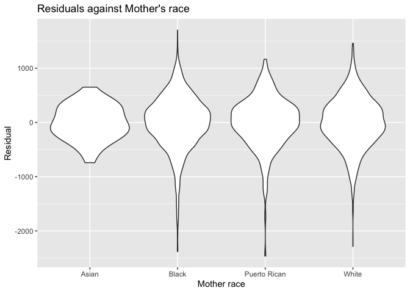
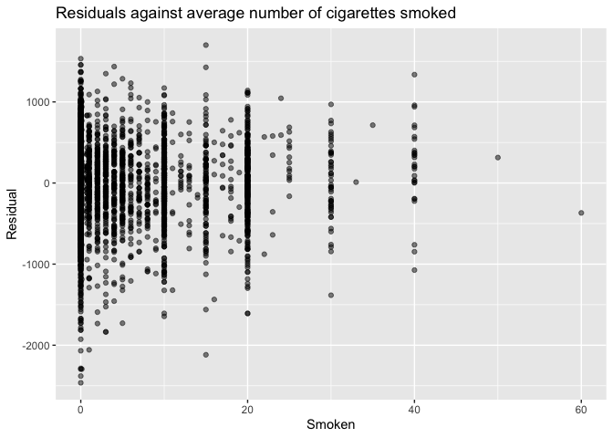
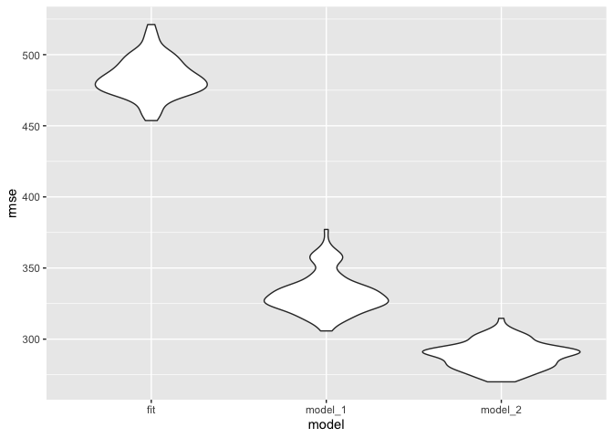
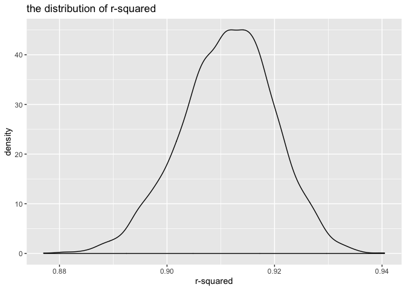
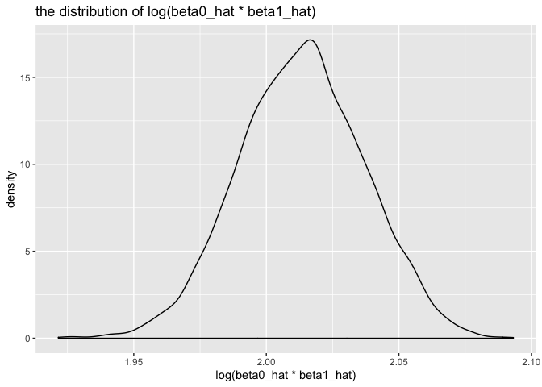

p8105\_hw6\_al3998
================
AimingLiu
11/15/2019

## Problem 1

``` r
child_birth_data = read_csv("./data/birthweight.csv") %>% 
janitor::clean_names() %>% 
  mutate(babysex = factor(recode(babysex,"1" = "male","2" = "famle" )),
        frace = factor(recode(frace,"1" = "White","2" = "Black" ,"3" = "Asian", "4"= "Puerto Rican","8"  = "Other", "9" = "Unknown")),
        mrace = factor(recode(mrace,"1" = "White","2" = "Black" ,"3" = "Asian", "4"= "Puerto Rican","8"  = "Other")),
        malform = factor(recode(malform,"0" = "absent","1" = "present")))
```

## Propose a regression model for birthweigh

Child’s birth weight may depend on the factor ‘mrace’ which tells us
about the mother’s race,‘smoken’ which tells us about the average number
of cigarettes smoked per day during pregnancy.

I fit the model in the following chunk

``` r
 fit = lm(bwt ~ smoken + mrace,data = child_birth_data)
 
  fit %>% 
  broom::tidy() %>% 
  select(term, estimate, p.value) %>% 
  mutate(term = str_replace(term, "^mrace", "Race: ")) %>% 
  knitr::kable()
```

| term               |    estimate |   p.value |
| :----------------- | ----------: | --------: |
| (Intercept)        |  3149.05942 | 0.0000000 |
| smoken             |  \-11.16338 | 0.0000000 |
| Race: Black        | \-173.99850 | 0.0193716 |
| Race: Puerto Rican |  \-61.89303 | 0.4381197 |
| Race: White        |   185.21279 | 0.0129217 |

``` r
modelr::add_residuals(child_birth_data, fit)
```

    ## # A tibble: 4,342 x 21
    ##    babysex bhead blength   bwt delwt fincome frace gaweeks malform menarche
    ##    <fct>   <dbl>   <dbl> <dbl> <dbl>   <dbl> <fct>   <dbl> <fct>      <dbl>
    ##  1 famle      34      51  3629   177      35 White    39.9 absent        13
    ##  2 male       34      48  3062   156      65 Black    25.9 absent        14
    ##  3 famle      36      50  3345   148      85 White    39.9 absent        12
    ##  4 male       34      52  3062   157      55 White    40   absent        14
    ##  5 famle      34      52  3374   156       5 White    41.6 absent        13
    ##  6 male       33      52  3374   129      55 White    40.7 absent        12
    ##  7 famle      33      46  2523   126      96 Black    40.3 absent        14
    ##  8 famle      33      49  2778   140       5 White    37.4 absent        12
    ##  9 male       36      52  3515   146      85 White    40.3 absent        11
    ## 10 male       33      50  3459   169      75 Black    40.7 absent        12
    ## # … with 4,332 more rows, and 11 more variables: mheight <dbl>,
    ## #   momage <dbl>, mrace <fct>, parity <dbl>, pnumlbw <dbl>, pnumsga <dbl>,
    ## #   ppbmi <dbl>, ppwt <dbl>, smoken <dbl>, wtgain <dbl>, resid <dbl>

``` r
modelr::add_predictions(child_birth_data, fit)
```

    ## # A tibble: 4,342 x 21
    ##    babysex bhead blength   bwt delwt fincome frace gaweeks malform menarche
    ##    <fct>   <dbl>   <dbl> <dbl> <dbl>   <dbl> <fct>   <dbl> <fct>      <dbl>
    ##  1 famle      34      51  3629   177      35 White    39.9 absent        13
    ##  2 male       34      48  3062   156      65 Black    25.9 absent        14
    ##  3 famle      36      50  3345   148      85 White    39.9 absent        12
    ##  4 male       34      52  3062   157      55 White    40   absent        14
    ##  5 famle      34      52  3374   156       5 White    41.6 absent        13
    ##  6 male       33      52  3374   129      55 White    40.7 absent        12
    ##  7 famle      33      46  2523   126      96 Black    40.3 absent        14
    ##  8 famle      33      49  2778   140       5 White    37.4 absent        12
    ##  9 male       36      52  3515   146      85 White    40.3 absent        11
    ## 10 male       33      50  3459   169      75 Black    40.7 absent        12
    ## # … with 4,332 more rows, and 11 more variables: mheight <dbl>,
    ## #   momage <dbl>, mrace <fct>, parity <dbl>, pnumlbw <dbl>, pnumsga <dbl>,
    ## #   ppbmi <dbl>, ppwt <dbl>, smoken <dbl>, wtgain <dbl>, pred <dbl>

### Show a plot of model residuals against mother’s race

``` r
child_birth_data %>% 
  modelr::add_residuals(fit) %>% 
  ggplot(aes(x =mrace, y = resid)) + 
  geom_violin()+
  labs(title = "Residuals against Mother's race",x = "Mother race",y = "Residual")
```

<!-- -->

### Show a plot of model residuals against mother’s average number of cigarettes smoked per day during pregnancy

``` r
child_birth_data %>% 
  modelr::add_residuals(fit) %>% 
  ggplot(aes(x = smoken, y = resid)) + 
  geom_point(alpha = .5)+
  labs(title = "Residuals against average number of cigarettes smoked",x = "Smoken",y = "Residual")
```

<!-- -->

``` r
model_1 = lm(bwt ~ blength + gaweeks,data = child_birth_data)
model_2 = lm(bwt ~ bhead*blength + bhead*babysex + blength*babysex + bhead*babysex*blength,data = child_birth_data)
```

### Hypothesis testing

Compare my model to two others

``` r
cv_df =
  crossv_mc(child_birth_data, 100) %>% 
  mutate(
    train = map(train, as_tibble),
    test = map(test, as_tibble))

cv_df = 
  cv_df %>% 
  mutate(fit_mod = map(train,~lm(bwt ~ smoken + mrace,data = .x)),
         model_1_mod = map(train, ~lm(bwt ~ blength + gaweeks,data = .x)),
         model_2_mod = map(train, ~lm(bwt ~ bhead*blength + bhead*babysex + blength*babysex + bhead*babysex*blength,data = .x))) %>% 
   mutate(rmse_fit = map2_dbl(fit_mod, test, ~rmse(model = .x, data = .y)),
         rmse_model_1 = map2_dbl(model_1_mod, test, ~rmse(model = .x, data = .y)),
         rmse_model_2 = map2_dbl(model_2_mod, test, ~rmse(model = .x, data = .y)))
```

``` r
cv_df %>% 
  select(starts_with("rmse")) %>% 
pivot_longer(
    everything(),
    names_to = "model", 
    values_to = "rmse",
    names_prefix = "rmse_") %>% 
  mutate(model = fct_inorder(model)) %>% 
  ggplot(aes(x = model, y = rmse)) + geom_violin()
```

<!-- --> As
we can see from the graphic of distribution of RMSE,it can be discovered
that the RSME of the model using head circumference, length, sex, and
all interactions is the smallest,so that we can conclude that this model
is the best among these three models.

## Problem 2

``` r
weather_df = 
  rnoaa::meteo_pull_monitors(
    c("USW00094728"),
    var = c("PRCP", "TMIN", "TMAX"), 
    date_min = "2017-01-01",
    date_max = "2017-12-31") %>%
  mutate(
    name = recode(id, USW00094728 = "CentralPark_NY"),
    tmin = tmin / 10,
    tmax = tmax / 10) %>%
  select(name, id, everything())
```

### show the plot of distribution of r-squared

``` r
boot_straps = 
  weather_df %>% 
  modelr::bootstrap(n = 5000)

bootstrap_results = 
  boot_straps %>% 
  mutate(
    models = map(strap, ~lm(tmax ~ tmin, data = .x) ),
    results = map(models, broom::glance)) %>% 
  select(-strap, -models) %>% 
  unnest(results) %>% 
  select(r.squared,adj.r.squared) 
  #summarize(ci_r = CI(r.squared,ci = 0.95))

bootstrap_results %>% 
  ggplot(aes(x = r.squared))+ geom_density()+
  labs(title = "the distribution of r-squared",
       x = "r-squared")
```

<!-- -->
This distribution has a light tail extending to low values, features
that may be related to the frequency with which some outliers are
included in the bootstrap
sample.

### Identify the 2.5% and 97.5% quantiles to provide a 95% confidence interval for r-squared

``` r
qua_r1 = quantile(bootstrap_results$r.squared,probs = .025)
qua_r2 = quantile(bootstrap_results$r.squared,probs = .975)
```

After calculating,the 95% confidence for r-squared is \[0.894,0.927\]

### show the plot of distribution of log(beta0\_hat \* beta1\_hat)

``` r
bootstrap_results_1 = 
  boot_straps %>% 
  mutate(
    models = map(strap, ~lm(tmax ~ tmin, data = .x) ),
    results = map(models, broom::tidy)) %>% 
  select(-strap, -models) %>% 
  unnest(results) %>% 
  select(.id,term,estimate) %>% 
  pivot_wider(names_from = term,values_from = estimate) %>% 
  janitor::clean_names() %>% 
  mutate(log_coe = log(intercept*tmin))

bootstrap_results_1 %>% 
  ggplot(aes(x = log_coe))+ geom_density()+
  labs(title = "the distribution of log(beta0_hat * beta1_hat)",
       x = "log(beta0_hat * beta1_hat)")
```

<!-- -->
This distribution is not a normal distribution,and it may do not have a
lot of outliers,the shape of the distribution is almost
symmetric.

### Identify the 2.5% and 97.5% quantiles to provide a 95% confidence interval for log(beta0\_hat \* beta1\_hat)

``` r
qua_log1 = quantile(bootstrap_results_1$log_coe,probs = .025)
qua_log2 = quantile(bootstrap_results_1$log_coe,probs = .975)
```

After calculating,the 95% confidence for log(beta0\_hat \* beta1\_hat)
is \[1.965,2.0584\]
